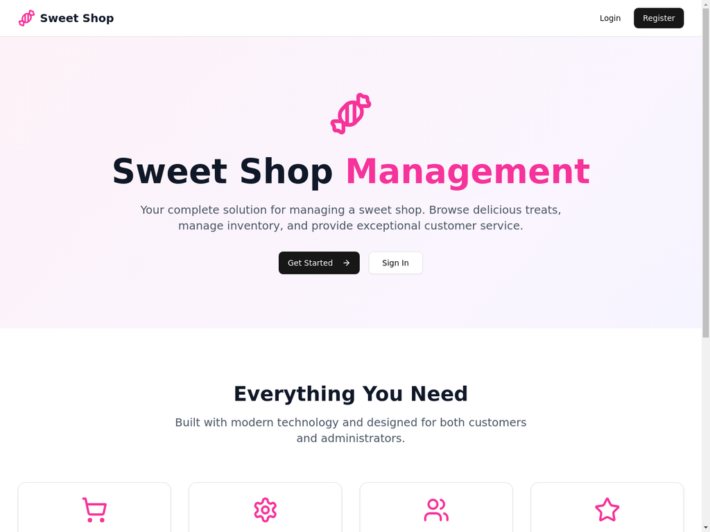
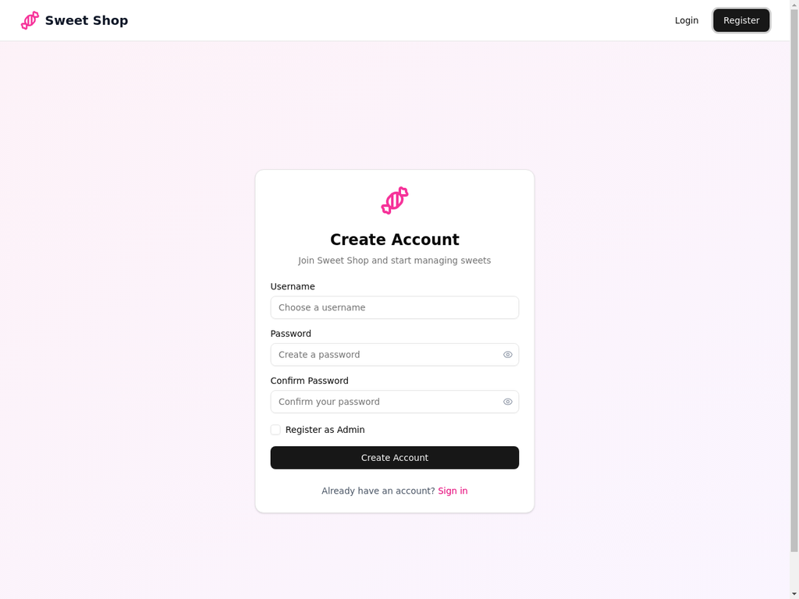
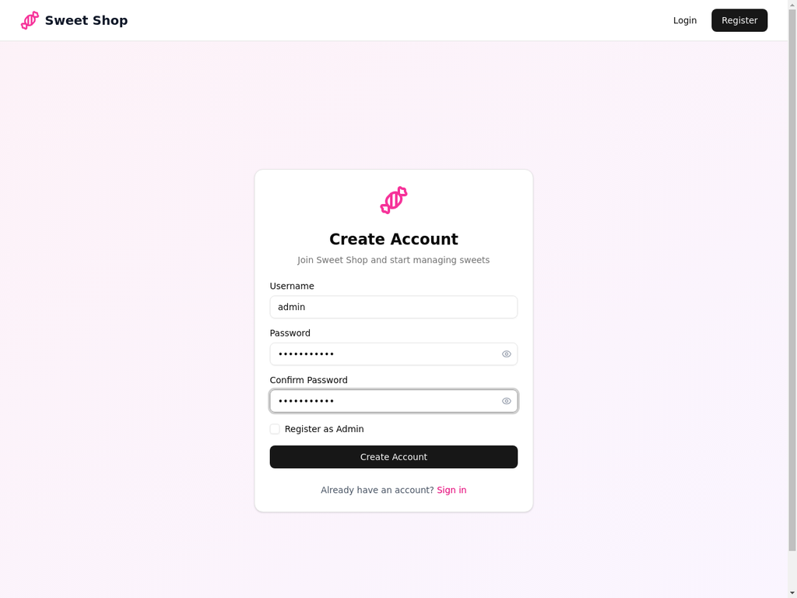
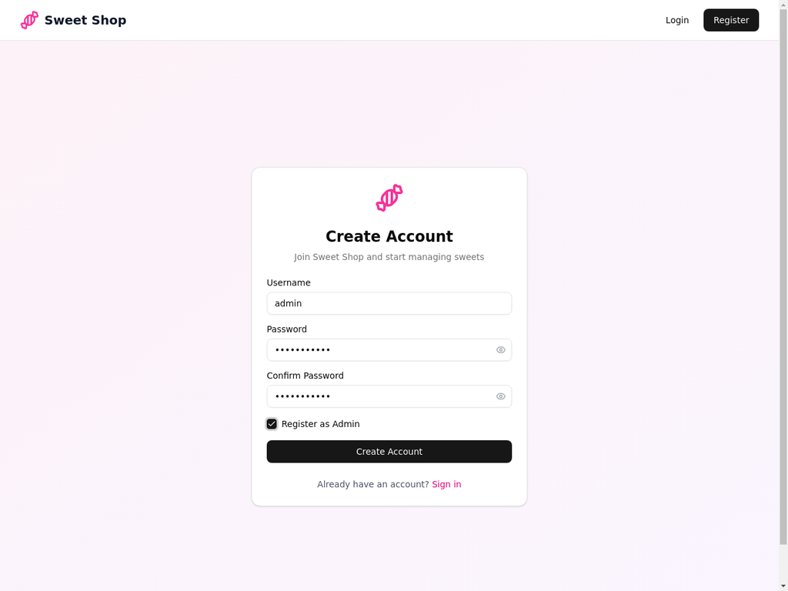
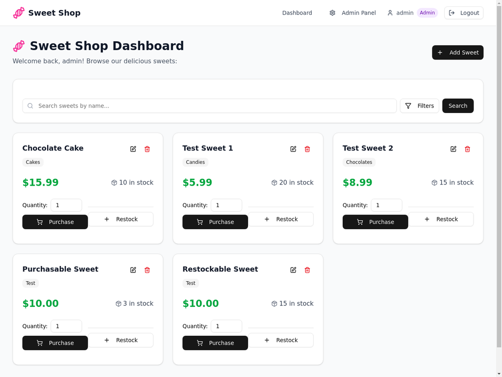
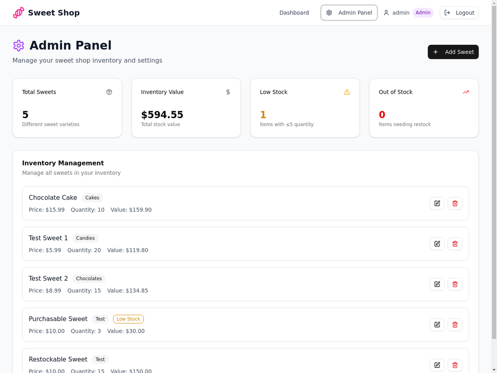

# Sweet Shop Management System

A full-stack web application for managing a sweet shop, built with React frontend and Express.js backend. This project demonstrates modern web development practices including RESTful API design, JWT authentication, responsive UI design, and comprehensive testing.

## 🍭 Features

### Customer Features
- **User Registration & Login**: Secure authentication with JWT tokens
- **Browse Sweets**: View all available sweets with detailed information
- **Search & Filter**: Find sweets by name, category, or price range
- **Purchase System**: Buy sweets with real-time inventory updates
- **Responsive Design**: Works seamlessly on desktop and mobile devices

### Admin Features
- **Inventory Management**: Add, edit, and delete sweets
- **Stock Control**: Restock items and monitor inventory levels
- **Admin Dashboard**: Overview of total inventory, low stock alerts, and statistics
- **User Management**: Role-based access control

### Technical Features
- **RESTful API**: Clean, well-documented API endpoints
- **JWT Authentication**: Secure token-based authentication
- **Real-time Updates**: Inventory updates reflect immediately
- **Input Validation**: Comprehensive client and server-side validation
- **Error Handling**: Graceful error handling with user-friendly messages
- **Responsive UI**: Built with Tailwind CSS and shadcn/ui components

## Screenshots











## 🛠 Technology Stack

### Backend
- **Node.js** - Runtime environment
- **Express.js** - Web framework
- **SQLite** - Database (with Sequelize ORM)
- **JWT** - Authentication tokens
- **bcryptjs** - Password hashing
- **Jest & Supertest** - Testing framework

### Frontend
- **React** - UI library
- **React Router** - Client-side routing
- **Tailwind CSS** - Utility-first CSS framework
- **shadcn/ui** - Modern UI components
- **Lucide Icons** - Beautiful icons
- **Axios** - HTTP client
- **Sonner** - Toast notifications

## 📁 Project Structure

```
sweet_shop_project/
├── backend/                 # Express.js backend
│   ├── config/             # Database configuration
│   ├── controllers/        # Route controllers
│   ├── middleware/         # Custom middleware
│   ├── models/            # Database models
│   ├── routes/            # API routes
│   ├── services/          # Business logic
│   ├── tests/             # Test files
│   ├── utils/             # Utility functions
│   ├── server.js          # Main server file
│   └── package.json       # Dependencies
├── frontend/               # React frontend
│   ├── public/            # Static assets
│   ├── src/
│   │   ├── components/    # React components
│   │   ├── contexts/      # React contexts
│   │   ├── pages/         # Page components
│   │   ├── services/      # API services
│   │   ├── utils/         # Utility functions
│   │   └── App.jsx        # Main app component
│   └── package.json       # Dependencies
├── docs/                  # Documentation
└── README.md             # This file
```

## 🚀 Quick Start

### Prerequisites
- Node.js (v16 or higher)
- npm or pnpm package manager

### Installation

1. **Extract the project files**
   ```bash
   unzip sweet_shop_project.zip
   cd sweet_shop_project
   ```

2. **Setup Backend**
   ```bash
   cd backend
   npm install
   npm run dev
   ```
   The backend will start on http://localhost:3001

3. **Setup Frontend** (in a new terminal)
   ```bash
   cd frontend
   npm install
   npm run dev
   ```
   The frontend will start on http://localhost:5173

4. **Access the Application**
   - Open your browser and go to http://localhost:5173
   - Register a new account (check "Register as Admin" for admin privileges)
   - Start managing your sweet shop!

## 🧪 Testing

### Backend Tests
```bash
cd backend
npm test
```

The test suite includes:
- Authentication endpoint tests
- Sweet management endpoint tests
- Database integration tests
- Error handling tests

### Test Coverage
- **21 test cases** covering all major functionality
- Authentication flows (register, login)
- CRUD operations for sweets
- Inventory management (purchase, restock)
- Input validation and error handling

## 📚 API Documentation

### Authentication Endpoints

#### POST /api/auth/register
Register a new user account.

**Request Body:**
```json
{
  "username": "string",
  "password": "string",
  "isAdmin": "boolean (optional)"
}
```

**Response:**
```json
{
  "user": {
    "id": "number",
    "username": "string",
    "is_admin": "boolean"
  },
  "token": "string"
}
```

#### POST /api/auth/login
Login with existing credentials.

**Request Body:**
```json
{
  "username": "string",
  "password": "string"
}
```

### Sweet Management Endpoints

#### GET /api/sweets
Get all sweets (requires authentication).

#### GET /api/sweets/search
Search sweets with filters.

**Query Parameters:**
- `name` - Search by name
- `category` - Filter by category
- `minPrice` - Minimum price
- `maxPrice` - Maximum price

#### POST /api/sweets
Add a new sweet (admin only).

**Request Body:**
```json
{
  "name": "string",
  "category": "string",
  "price": "number",
  "quantity": "number"
}
```

#### PUT /api/sweets/:id
Update sweet details (admin only).

#### DELETE /api/sweets/:id
Delete a sweet (admin only).

#### POST /api/sweets/:id/purchase
Purchase a sweet.

**Request Body:**
```json
{
  "quantity": "number"
}
```

#### POST /api/sweets/:id/restock
Restock a sweet (admin only).

**Request Body:**
```json
{
  "quantity": "number"
}
```

## 🎨 UI Components

The frontend uses a modern component-based architecture with:

- **Responsive Navigation Bar** - Clean navigation with user status
- **Authentication Forms** - Beautiful login/register forms with validation
- **Sweet Cards** - Interactive cards showing sweet details
- **Search & Filter** - Advanced search functionality
- **Admin Dashboard** - Comprehensive inventory management
- **Toast Notifications** - User-friendly feedback system

## 🔒 Security Features

- **JWT Authentication** - Secure token-based authentication
- **Password Hashing** - bcrypt for secure password storage
- **Input Validation** - Both client and server-side validation
- **CORS Configuration** - Proper cross-origin resource sharing
- **Role-based Access** - Admin-only endpoints protection

## 🌟 Key Highlights

1. **Modern Architecture** - Clean separation of concerns with MVC pattern
2. **Responsive Design** - Mobile-first approach with Tailwind CSS
3. **Real-time Updates** - Immediate inventory updates across the system
4. **Comprehensive Testing** - 21 test cases with high coverage
5. **Professional UI** - Modern design with smooth animations
6. **Error Handling** - Graceful error handling with user feedback
7. **Documentation** - Well-documented code and API endpoints

## 🚀 Deployment

### Backend Deployment
The backend can be deployed to platforms like:
- Heroku
- Railway
- Render
- DigitalOcean App Platform

### Frontend Deployment
The frontend can be deployed to:
- Vercel
- Netlify
- GitHub Pages
- AWS S3 + CloudFront

### Environment Variables
Create a `.env` file in the backend directory:
```
PORT=3001
JWT_SECRET=your_jwt_secret_key_here
NODE_ENV=production
DB_PATH=./database.sqlite
```
## 📝 License

This project is created for educational and demonstration purposes.

## 🙏 Acknowledgments

- Built with modern web technologies
- Inspired by real-world e-commerce applications
- Designed with user experience as a priority

---

**Happy Sweet Shopping! 🍭**

